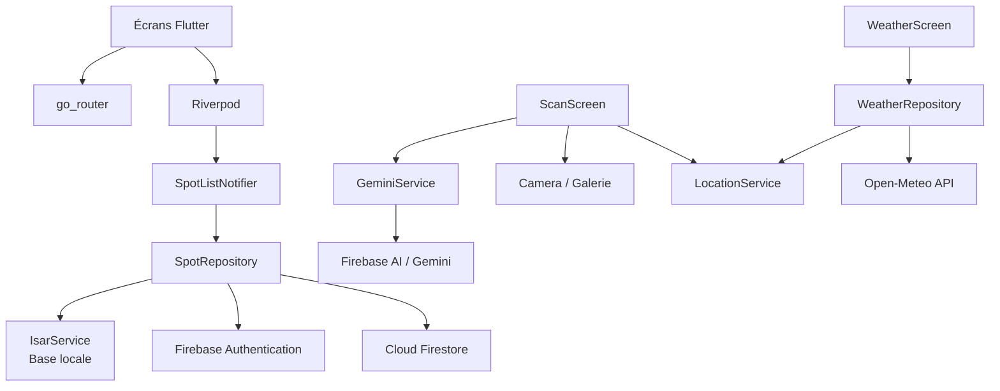
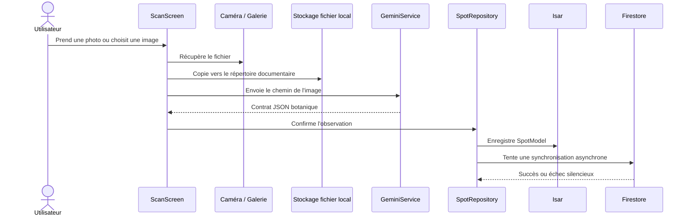
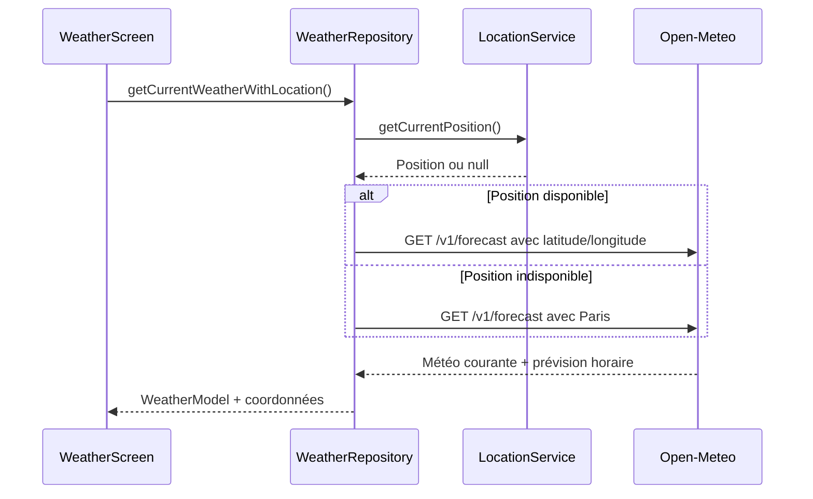

# Architecture UrbanFlora

Ce document décrit l'organisation technique de l'application, les responsabilités des couches et les flux de données principaux.

## Vue d'ensemble

UrbanFlora est une application Flutter organisée autour d'une séparation UI, état, repositories et services externes. Le stockage local est la source de disponibilité immédiate ; Firebase fournit l'authentification et la synchronisation Cloud.



## Couches applicatives

| Couche | Emplacement | Responsabilité |
| --- | --- | --- |
| Entrée | `lib/main.dart` | Initialise Flutter, Firebase et Firebase App Check |
| Navigation | `lib/constants/app_router.dart` | Déclare les routes et les écrans associés |
| Présentation | `lib/screens/`, `lib/widgets/` | Affiche les écrans et recueille les actions utilisateur |
| État | `lib/providers/` | Expose l'état asynchrone avec Riverpod |
| Domaine | `lib/models/` | Définit `SpotModel` et `WeatherModel` |
| Accès aux données | `lib/repositories/` | Coordonne les sources locales et distantes |
| Services | `lib/services/` | Encapsule Isar, Gemini, localisation et appels HTTP |
| Configuration | `lib/constants/`, `firebase_options.dart` | Thème, couleurs et configuration Firebase |

## Initialisation de l'application

1. `WidgetsFlutterBinding.ensureInitialized()` prépare Flutter.
2. `Firebase.initializeApp()` initialise Firebase avec `DefaultFirebaseOptions`.
3. Firebase App Check est activé en mode debug pour Apple et Android.
4. `ProviderScope` monte l'application Riverpod.
5. `MaterialApp.router` utilise `appRouter`.

La route initiale est `/onboarding`. Les routes déclarées sont `/auth`, `/`, `/scan`, `/weather`, `/profile` et `/detail`.

## Flux de capture et d'identification



### Cas nominal

- L'image est conservée dans le répertoire documentaire de l'application.
- Gemini renvoie les informations botaniques.
- L'observation est affichée dans l'écran de détail.
- L'utilisateur confirme son ajout à l'herbier.
- Isar est mis à jour, puis une tentative de synchronisation Firestore est lancée.

### Cas hors-ligne ou erreur IA

- L'image est tout de même conservée localement.
- Un `SpotModel` est créé avec `confidence: 0.0`.
- Le nom scientifique indique `Non identifié (hors-ligne)`.
- La prochaine synchronisation peut relancer l'analyse des observations en attente.

## Flux herbier et synchronisation

```mermaid
flowchart LR
    Local[Observations Isar] --> Pending{confidence == 0 ?}
    Pending -->|Oui| Analyze[GeminiService.identifyPlant]
    Analyze --> Save[Mettre à jour SpotModel]
    Pending -->|Non| Sync
    Save --> Sync[SpotRepository.syncAllWithCloud]
    Sync --> Auth[Utilisateur Firebase courant<br/>ou session anonyme]
    Auth --> Firestore[users/{uid}/spots/{cloudId}]
    Firestore --> Mark[isSynced = true]
```

`SpotRepository` utilise Isar pour les lectures et écritures immédiates. Lorsqu'un utilisateur n'est pas authentifié, le repository tente une connexion anonyme avant l'écriture Firestore. Un échec Cloud ne bloque pas la conservation locale.

Lors d'une connexion avec un compte, `fetchSpotsFromCloud()` vide la collection locale puis reconstruit les observations à partir de `users/{uid}/spots`.

## Flux météo



La position par défaut est Paris (`48.8566`, `2.3522`). Si Open-Meteo échoue, le repository retourne également une valeur météo de secours afin que l'écran reste utilisable.

## Modèle de données `SpotModel`

| Champ | Type | Description |
| --- | --- | --- |
| `id` | `int` | Identifiant local Isar auto-incrémenté |
| `cloudId` | `String` | Identifiant partagé utilisé comme document Firestore |
| `commonName` | `String` | Nom usuel |
| `scientificName` | `String` | Nom scientifique |
| `family` | `String` | Famille botanique |
| `confidence` | `double` | Confiance de l'identification, généralement de `0.0` à `1.0` |
| `ecologicalNiche` | `String` | Description de l'habitat et du rôle écologique |
| `imagePath` | `String` | Nom ou chemin local de l'image |
| `latitude` / `longitude` | `double` | Coordonnées de capture |
| `districtName` | `String?` | Zone ou quartier éventuel |
| `temperature` | `double` | Température associée à la capture |
| `humidity` | `int` | Humidité associée à la capture |
| `rainRisk` | `double` | Risque de pluie associé à la capture |
| `createdAt` | `DateTime` | Date de création |
| `isSynced` | `bool` | Indique si l'observation est synchronisée |

## Sécurité et limites

- Firebase App Check est configuré avec les fournisseurs debug dans le code actuel ; une configuration de production est nécessaire avant déploiement.
- Les règles Firestore doivent limiter l'accès à `users/{uid}/spots` au propriétaire authentifié.
- Les images ne sont pas stockées dans Firebase Storage. Le champ `imagePath` n'est donc pas une URL partageable entre appareils.
- Les routes sont déclarées mais aucun redirect global ne force encore l'authentification.
